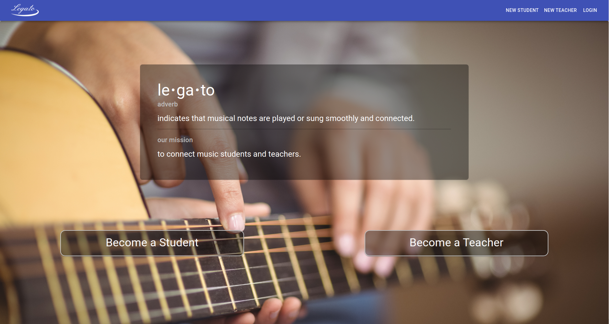
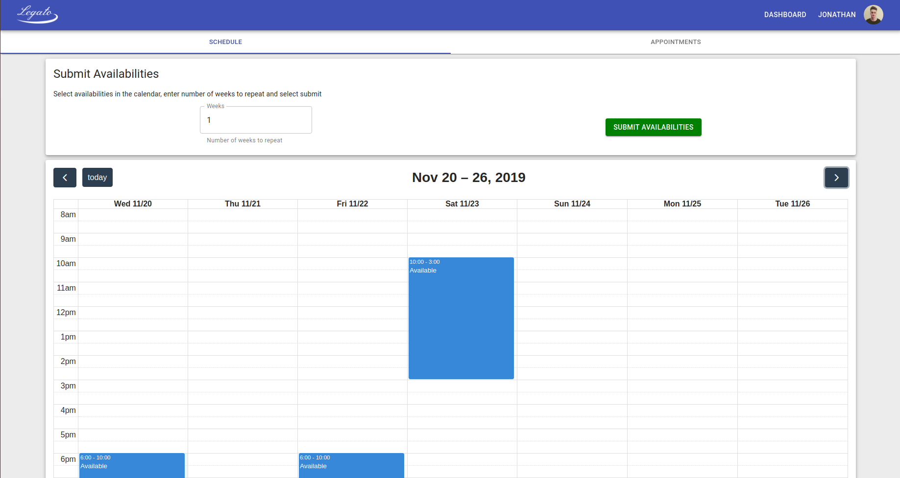
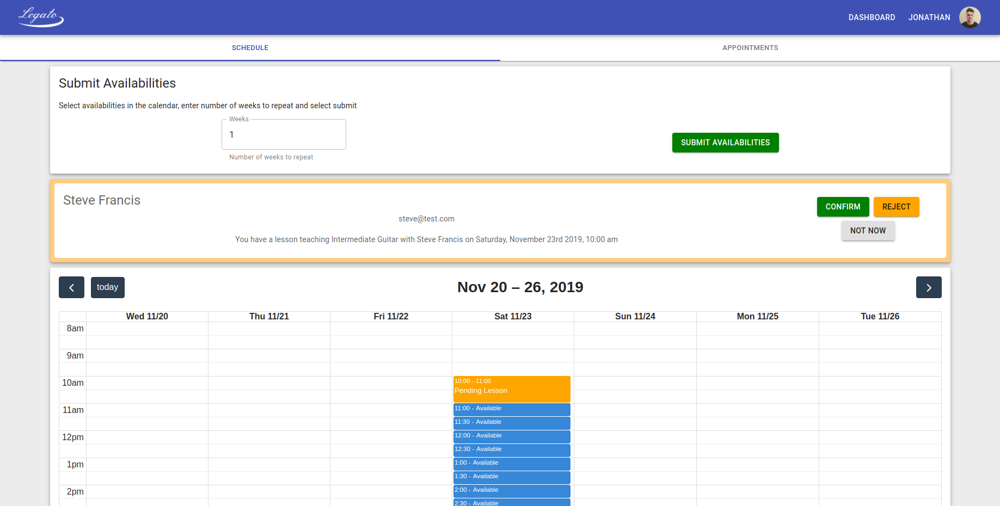

# Legato

### Lighthouse Labs final project.   Contributors: [Aaron Tagadtad](https://github.com/atagadtad), [Cameron Dunning](https://github.com/CameronDunning), [Jonathan Milne-Skarzenski](https://github.com/jonny-ms)

## Description

Legato aims to connect music students and teachers. 
A teacher can register, create a profile, add courses, add videos, create availabilities.
A student can search all registered teachers and filter by name, rate, instrument, and level. They can view teacher profiles and schedules. They can request lessons based on teacher's availabilities.
A teacher then sees the requested lesson, and can accept or reject it. They also have a list view of all pending lessons, and past lessons that have not yet been paid. The intention here is to implement an Uber-style teacher initiated payment system.

## Setup

To set up locally, the back end API is needed and can be found here: https://github.com/jonny-ms/legato-server. Follow README instructions to set up database.

Install dependencies with `npm install`.

Run with `npm start`.

## Screenshots

